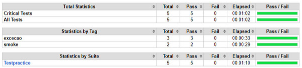
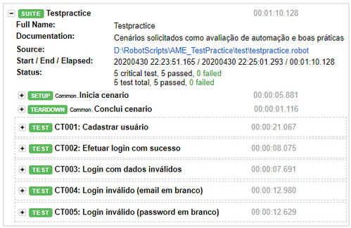
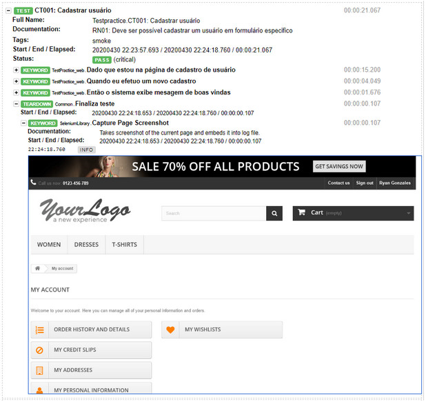

# Script de automação criado por solicitação, para avaliação.
> Tech: Visual Studio Code, Python e Robotframework.

**URL**
Site: http://automationpractice.com/

## Escopo

    * Cadastro, 
    * login com sucesso (com usuário que foi cadastrado), 
    * Login invalido (credenciais invalidas), 
    * Login inválido (mantendo um dos campos sem preenchimento)

**Cenários**

Criação de cenarios em Gherkin (BDD).

    * 1ª camada em abstração Gherkin,
    * 2ª camada em abordagem descritiva,
    * 3ª camada usando Page Objects.

Descrevendo cenários de teste dessa forma o relatório gerado pode ser lido por qualquer pessoa, e será facilmente identificado onde uma falha ocorreu. É de grande ajuda também para manutenção de scripts, pois é mais fácil de isolar onde ocorreu o problema.

## Relatório

Relatório gerado pela ferramenta e disponivel para consulta, no diretório **Result**. Por default, o framework já armazena prints de tela para cada falha, porém o script foi desenvolvido para "printar" a cada final de cenário executado e exibir esses prints no relatorio. 

O script esta setado em seu código para ser executado pelo chrome, porém o browser pode ser alterado diretamente pela linha de comando para execução do script, alterando a variavel _BROWSER_ para ie, chrome, headlessechrome, safari, etc.

EX:
```javascript
    robot -d result --reporttitle "Test Practice - Test Report" --logtitle "Test Practice - Log Report"  -v BROWSER:headlessfirefox test/testpractice.robot
```
Este comando executa a suite de testes testpractice.robot armazenando o relatorio no diretório _Result_, com o browser firefox em headless mode, e também customizando o título do relatório gerado.

## Amostra do relatório










## Ressalvas
Adicionei arquivo gitignore apenas para não versionar arquivo de log do webdriver. O relatório gerado será armazenado para mostrar o formato do report.

Ao longo do script eu inseri comentarios para explicar o fluxo ou sobre algum tipo de limitação na aplicação, como por exemplo para a exclusão de um usuário já existente. 
O sistema não permite a exclusão do usuário cadastrado, logo não é possivel criar uma rotina para verificar se a massa de teste utilizada na regressão já se encontra cadastrada, e excluí-la no início dos testes.

Neste caso existem tres opções, ou se utiliza uma entrada de dados externa (Data Driven), uma geração de massa randomica, ou se altera na mão a massa de testes, a cada nova bateria de testes.

Utilizei a abordagem de geração de massa randômica para cada cadastro, então as variaveis **first_name**, **last_name** e **email** são setadas randomicamente no arquivo Common.robot, utilizando biblioteca Faker do Robotframework.